# 👁️ DrishtiX™ Azure AI Solution Architecture

**Enterprise Crowd Safety System**  
**Version**: 3.0.0  
**Last Updated**: January 10, 2026

---

## 🏗️ High-Level Architecture Overview

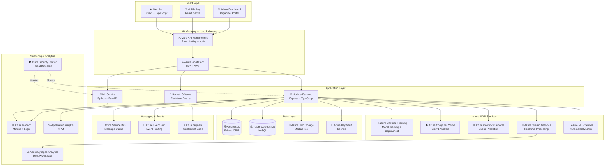

---

## 🔍 Detailed Component Architecture

### 1. Client Layer

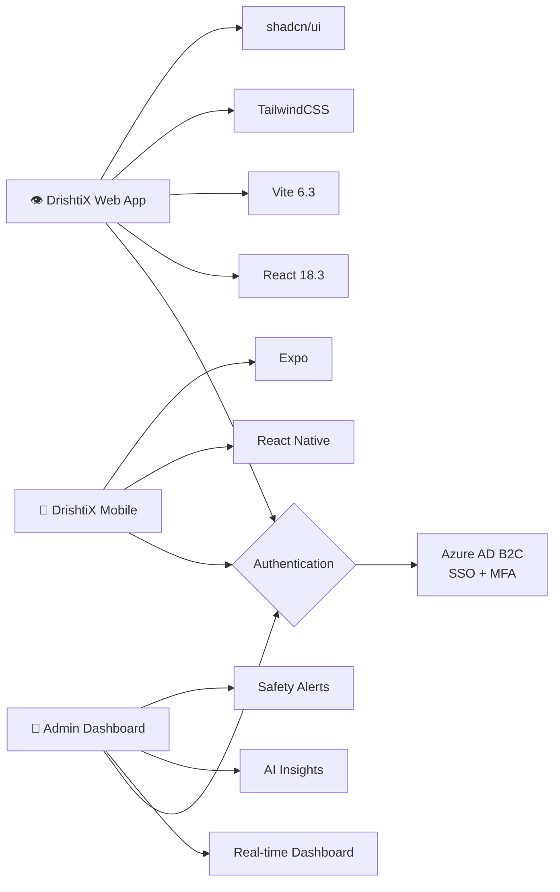

### 2. Azure AI/ML Services Integration

```mermaid
graph TB
    subgraph "Azure ML Workspace"
        A[🧠 Azure Machine Learning]
        A1[Model Training]
        A2[Model Registry]
        A3[Model Deployment]
        A4[Endpoint Safety]

        A --> A1
        A --> A2
        A --> A3
        A --> A4
    end

    subgraph "Computer Vision"
        B[👁️ Azure Computer Vision]
        B1[Person Detection]
        B2[Crowd Analysis]
        B3[Density Heatmap]
        B4[Anomaly Detection]

        B --> B1
        B --> B2
        B --> B3
        B --> B4
    end

    subgraph "Cognitive Services"
        C[📊 Azure Cognitive Queue]
        C1[Queue Prediction]
        C2[Wait Time Estimation]
        C3[M/M/c Optimization]

        C --> C1
        C --> C2
        C --> C3
    end

    subgraph "Stream Analytics"
        D[🌊 Azure Stream Analytics]
        D1[Real-time Aggregation]
        D2[Anomaly Detection]
        D3[Queue Metrics]
        D4[Event Processing]

        D --> D1
        D --> D2
        D --> D3
        D --> D4
    end

    subgraph "ML Pipelines"
        E[🔄 Azure ML Pipelines]
        E1[Data Preparation]
        E2[Model Training]
        E3[Validation]
        E4[Deployment]

        E --> E1
        E1 --> E2
        E2 --> E3
        E3 --> E4
    end

    A1 --> F[📊 Training Data]
    A3 --> G[🚀 Production Models]

    B --> H[📹 Video Streams]
    C --> I[📈 Queue Data]
    D --> J[📡 Event Streams]

    G --> K[🔮 Predictions API]
    K --> L[🌐 Client Applications]
```

### 3. ML Model Pipeline

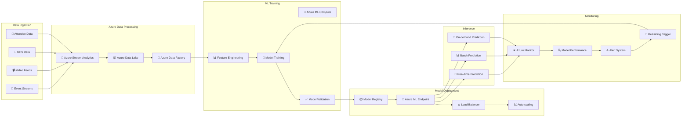

### 4. Data Flow Architecture

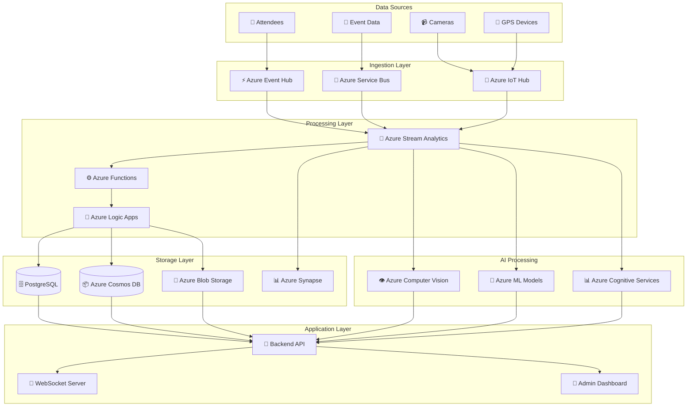

---

## 🔒 Security Architecture

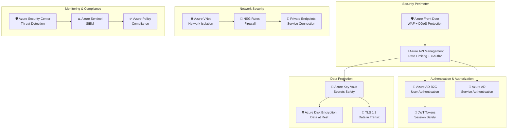

---

## ⚡ Real-time Processing Architecture

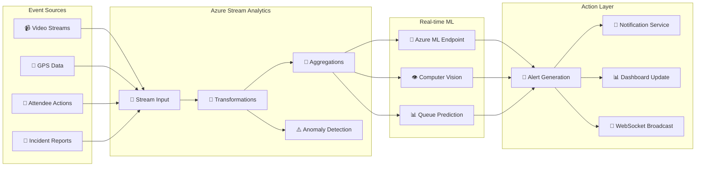

---

## 📊 ML Model Architecture

### ConvLSTM Crowd Forecasting

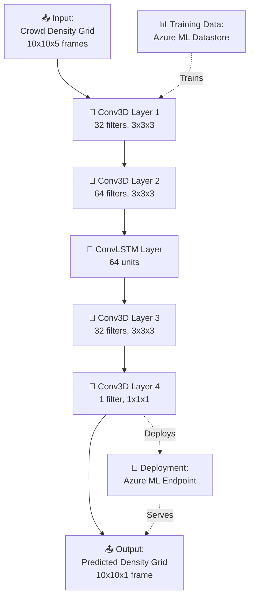

### Autoencoder Anomaly Detection

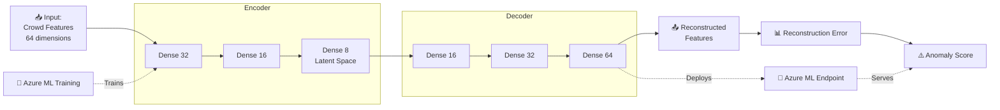

---

## 🚀 Deployment Architecture

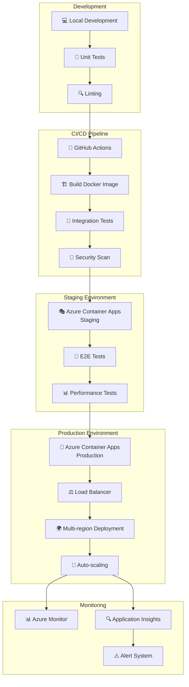

---

## 📊 Cost Optimization Architecture

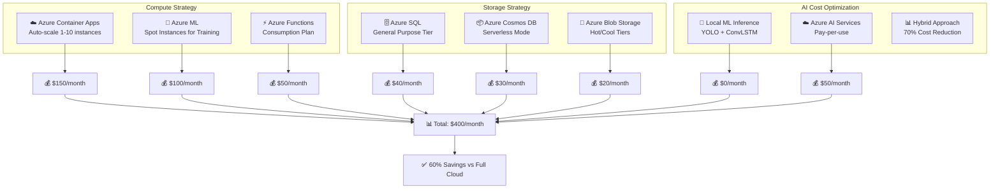

---

## 🔄 Disaster Recovery Architecture

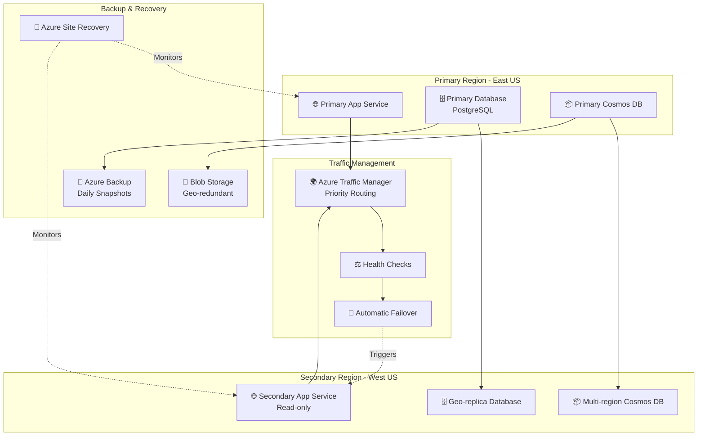

---

## 📈 Scalability Architecture

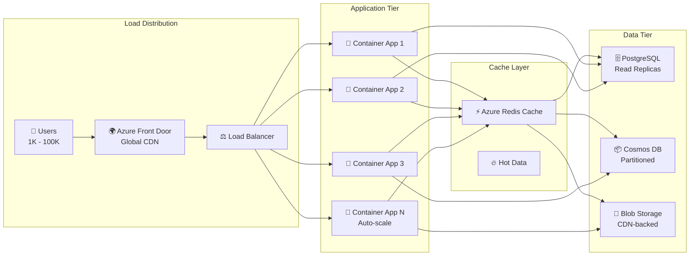

---

## 📞 Contact & Support

**Maintainer**: Jagan Hotta  
**Email**: jaganhotta357@outlook.com  
**Repository**: https://github.com/techySPHINX/DrishtiX

For architecture questions, improvements, or Azure integration support, please reach out via email or GitHub issues.

---

**© 2026 DrishtiX. All Rights Reserved.**

**Last Updated**: January 10, 2026  
**Architecture Version**: 3.0.0
