# EventSphere Organizer Workflow Flowchart

```mermaid
flowchart TD
    Start([Start]) --> Landing[Landing Page]
    Landing --> GetStarted[Get Started Button]
    GetStarted --> SelectRole{Select User Role}
    SelectRole -->|Organizer| AuthChoice{Login or Signup?}

    AuthChoice -->|New User| Signup[Sign Up Form]
    AuthChoice -->|Existing User| Login[Login Form]

    Signup --> ProfileSetup[Organizer Profile Setup]
    ProfileSetup --> Dashboard
    Login --> Dashboard[Organizer Dashboard]

    Dashboard --> MainActions{Main Actions}
    MainActions --> CreateEvent[Create New Event]
    MainActions --> ViewEvents[View Existing Events]
    MainActions --> Analytics[Analytics & Reports]
    MainActions --> Settings[Settings]

    CreateEvent --> EventWizard[Event Creation Wizard]

    EventWizard --> Step1[Step 1: Event Basics]
    Step1 --> Step1Details[• Event Name<br>• Date & Time<br>• Event Type<br>• Description<br>• Expected Attendees]
    Step1Details --> Step2

    Step2[Step 2: Venue Mapping] --> Step2Details[• Upload Venue Map<br>• Draw Zone Boundaries<br>• Mark Entry/Exit Points<br>• Define Restricted Areas]
    Step2Details --> Step3

    Step3[Step 3: Zone Capacity Setup] --> Step3Details[• Set Gate Capacities<br>• Define Zone Limits<br>• Configure Routes<br>• Emergency Exits]
    Step3Details --> Step4

    Step4[Step 4: Event Schedule] --> Step4Details[• Stage Timings<br>• Performance Schedule<br>• Key Milestones<br>• Break Periods]
    Step4Details --> Step5

    Step5[Step 5: Data Sources] --> Step5Details[• CCTV Integration<br>• Drone Coverage<br>• Mobile App Tracking<br>• Manual Sensors]
    Step5Details --> Step6

    Step6[Step 6: Select ML Mode] --> MLChoice{Choose ML Mode}
    MLChoice -->|Sports Event| SportsML[Sports Event ML<br>• Player Tracking<br>• Crowd Surge Detection]
    MLChoice -->|Concert| ConcertML[Concert ML<br>• Mosh Pit Detection<br>• Stage Rush Prevention]
    MLChoice -->|Rally/Protest| RallyML[Rally ML<br>• Panic Detection<br>• Bottleneck Alerts]
    MLChoice -->|Generic| GenericML[Generic ML<br>• Standard Crowd Analytics]

    SportsML --> Step7
    ConcertML --> Step7
    RallyML --> Step7
    GenericML --> Step7

    Step7[Step 7: Review & Publish] --> Review[• Review All Settings<br>• Verify Configurations<br>• Set Permissions]
    Review --> Publish{Publish Event?}

    Publish -->|Yes| PublishSuccess[✓ Event Published]
    Publish -->|No| EventWizard

    PublishSuccess --> GenerateCode[Generate Event Code & QR]
    GenerateCode --> EventOverview[Event Overview Page]

    EventOverview --> PreEventActions{Pre-Event Actions}

    PreEventActions --> RunSimulation[Run Digital Twin Simulation]
    RunSimulation --> SimResults[View Simulation Results<br>• Predicted Hotspots<br>• Bottleneck Warnings<br>• Capacity Issues]
    SimResults --> Adjustments{Make Adjustments?}

    Adjustments -->|Yes| AdjustSettings[Adjust Settings]
    AdjustSettings --> AdjustDetails[• Gate Timings<br>• Staff Placement<br>• Route Changes<br>• Capacity Limits]
    AdjustDetails --> RunSimulation

    Adjustments -->|No| MarkReady
    PreEventActions --> MarkReady[Mark Event as Ready]

    MarkReady --> LiveEvent[Live Event Starts]

    LiveEvent --> LiveDashboard[Live Monitoring Dashboard]

    LiveDashboard --> MonitoringFeatures[Monitoring Features]
    MonitoringFeatures --> Feature1[Live Heatmap<br>• Real-time Density<br>• Zone Colors<br>• People Count]
    MonitoringFeatures --> Feature2[Crowd Forecast<br>• 5-30 min predictions<br>• Risk Levels<br>• Hotspot Warnings]
    MonitoringFeatures --> Feature3[Anomaly Alerts<br>• Violence Detection<br>• Fire/Smoke<br>• Crowd Surge<br>• Panic Detection]
    MonitoringFeatures --> Feature4[Route Suggestions<br>• Optimal Paths<br>• Congestion Avoidance<br>• Emergency Routes]
    MonitoringFeatures --> Feature5[Staff Tracking<br>• Security Location<br>• Medical Teams<br>• Response Status]
    MonitoringFeatures --> Feature6[Broadcast Messaging<br>• Push Notifications<br>• Zone-specific Alerts<br>• General Announcements]

    Feature3 --> AlertReceived{Alert Received?}

    AlertReceived -->|Yes| AlertResponse[Alert Response Flow]
    AlertResponse --> Acknowledge[Acknowledge Alert]
    Acknowledge --> AssessAlert{Alert Severity?}

    AssessAlert -->|Critical| DispatchTeam[Dispatch Security/Medical Team]
    AssessAlert -->|High| RouteChange[Apply Route Change]
    AssessAlert -->|Medium| Broadcast[Broadcast Warning]
    AssessAlert -->|Low| Monitor[Continue Monitoring]

    DispatchTeam --> TrackResponse[Track Team Response<br>• ETA Display<br>• Status Updates<br>• Location Tracking]
    RouteChange --> UpdateMap[Update User Navigation Maps<br>• Push Route Changes<br>• Mark Closed Areas]
    Broadcast --> NotifyUsers[Send Zone Notifications]

    TrackResponse --> ResolutionCheck{Alert Resolved?}
    UpdateMap --> ResolutionCheck
    NotifyUsers --> ResolutionCheck
    Monitor --> ResolutionCheck

    ResolutionCheck -->|No| AlertResponse
    ResolutionCheck -->|Yes| MarkResolved[Mark Alert as Resolved]
    MarkResolved --> LiveDashboard

    AlertReceived -->|No| ContinueMonitoring[Continue Monitoring]
    ContinueMonitoring --> LiveDashboard

    LiveDashboard --> EventEnd{Event Ended?}

    EventEnd -->|No| LiveDashboard
    EventEnd -->|Yes| EndEvent[End Event]

    EndEvent --> AutoReport[Auto-Generate Event Report]
    AutoReport --> ReportContents[Report Contents:<br>• Total Attendance<br>• Alerts Summary<br>• Response Times<br>• Heatmap Playback<br>• Incident Logs<br>• ML Performance]

    ReportContents --> FeedbackReview[Review Feedback]
    FeedbackReview --> FeedbackData[• Attendee Ratings<br>• Safety Scores<br>• Navigation Feedback<br>• Issue Reports]

    FeedbackData --> StoreAnalytics[Store to Analytics Database]
    StoreAnalytics --> DashboardReturn[Return to Dashboard]

    DashboardReturn --> Dashboard

    ViewEvents --> EventList[Event List View]
    EventList --> EventActions{Event Actions}
    EventActions --> EditEvent[Edit Event]
    EventActions --> ViewReport[View Report]
    EventActions --> DuplicateEvent[Duplicate Event]
    EventActions --> ArchiveEvent[Archive Event]

    Analytics --> AnalyticsDash[Analytics Dashboard]
    AnalyticsDash --> AnalyticsView[• Historical Data<br>• Trends Analysis<br>• Comparison Reports<br>• Performance Metrics<br>• ROI Analysis]

    Settings --> SettingsMenu[Settings Menu]
    SettingsMenu --> SettingsOptions[• Profile Settings<br>• Team Management<br>• Notification Preferences<br>• Integration Settings<br>• Billing & Plans<br>• Security Settings]

    style Start fill:#4CAF50
    style PublishSuccess fill:#4CAF50
    style LiveEvent fill:#FF9800
    style AlertReceived fill:#F44336
    style EndEvent fill:#2196F3
    style Dashboard fill:#9C27B0
```



## Role-Based Access Control (RBAC)

### Organizer Permissions

**Full Access:**

- ✅ Create/Edit/Delete Events
- ✅ Configure ML Models
- ✅ View Live Monitoring Dashboard
- ✅ Dispatch Emergency Teams
- ✅ Broadcast Messages
- ✅ Access Analytics & Reports
- ✅ Manage Team Members
- ✅ Configure Venue Layouts
- ✅ Run Simulations

**Restricted Access:**

- ❌ Cannot access other organizers' events (unless shared)
- ❌ Cannot modify system-wide settings
- ❌ Limited to their organization's data

---

## Event Creation Workflow Details

### Step-by-Step Guide

#### Step 1: Event Basics

```
Fields:
- Event Name (required)
- Event Type (Sports/Concert/Rally/Festival/Other)
- Start Date & Time (required)
- End Date & Time (required)
- Expected Attendees (required)
- Description
- Venue Location
- Event Image/Banner
```

#### Step 2: Venue Mapping

```
Features:
- Upload venue blueprint/satellite image
- Interactive map drawing tools
- Zone boundary creation
- Gate/entry point marking
- Restricted area designation
- Emergency exit mapping
- Stage/VIP area definition
```

#### Step 3: Zone Capacity

```
Configuration:
- Per-zone capacity limits
- Gate throughput rates
- Maximum occupancy alerts
- Buffer zone settings
- Overflow area designation
```

#### Step 4: Schedule Setup

```
Timeline:
- Performance schedule
- Stage timings
- Break periods
- VIP sessions
- Security briefing times
- Emergency drills
```

#### Step 5: Data Sources

```
Integration:
- CCTV camera feeds (RTSP/HTTP)
- Drone video streams
- Mobile app GPS tracking
- Manual counting stations
- WiFi/Bluetooth sensors
- Ticket scanning gates
```

#### Step 6: ML Mode Selection

```
Sports Event:
- Player tracking
- Crowd surge detection
- Exit rush prediction

Concert/Festival:
- Mosh pit detection
- Stage rush prevention
- Sound-based panic detection

Rally/Protest:
- Panic wave detection
- Stampede risk analysis
- Bottleneck alerts

Generic:
- Standard crowd density
- Flow analysis
- Basic anomaly detection
```

---

## Live Monitoring Dashboard Components

### 1. Live Heatmap

- Real-time crowd density visualization
- Color-coded zones (Green → Yellow → Orange → Red)
- People count overlays
- 5-second refresh rate

### 2. Crowd Forecast Panel

- 5, 10, 15, 30-minute predictions
- Risk level indicators
- Hotspot warnings
- Trend graphs

### 3. Alert Management

- Alert priority queue
- One-click acknowledgment
- Team dispatch interface
- Alert history log

### 4. Route Management

- Current route status
- Congestion visualization
- Quick route modification tools
- User navigation updates

### 5. Staff Tracking

- Security team GPS locations
- Medical team availability
- Response team status
- ETA calculations

### 6. Communication Hub

- Zone-specific broadcasting
- Emergency announcements
- Push notification center
- SMS alert triggers

---

## Alert Response Workflow

### Critical Alert Flow

```
1. Alert Detected (AI/Manual)
   ↓
2. Auto-classify Severity
   ↓
3. Notify Organizer (Sound + Visual)
   ↓
4. Organizer Reviews
   ↓
5. Dispatch Response Team
   ↓
6. Track Team Movement
   ↓
7. Update Attendees (Route Changes)
   ↓
8. Monitor Resolution
   ↓
9. Mark as Resolved
   ↓
10. Log to Report
```

### Route Change Propagation

```
1. Organizer Marks Route as Blocked
   ↓
2. System Calculates Alternative Routes
   ↓
3. Push Notification to Affected Users
   ↓
4. Update Navigation Maps
   ↓
5. Monitor Crowd Redistribution
   ↓
6. Confirm Route Clear
   ↓
7. Reopen Route (Optional)
```

---

## Post-Event Report Contents

### Auto-Generated Sections

1. **Executive Summary**
   - Total attendance
   - Peak crowd time
   - Overall safety score

2. **Alerts & Incidents**
   - Total alerts triggered
   - Response times
   - Resolution details

3. **Crowd Analytics**
   - Heatmap playback
   - Flow patterns
   - Bottleneck analysis

4. **ML Performance**
   - Prediction accuracy
   - False positive rate
   - Model effectiveness

5. **Feedback Analysis**
   - Attendee ratings
   - Safety scores
   - Common issues

6. **Recommendations**
   - Improvements for next event
   - Capacity adjustments
   - Route optimizations

---

## Integration Points

### External Systems

- **Payment Gateways**: For ticketing
- **Email/SMS**: For notifications
- **Amazon Location Service**: For venue mapping
- **Weather APIs**: For condition monitoring
- **Social Media**: For sentiment analysis

### Internal Systems

- **Mobile App**: Real-time attendee tracking
- **Admin Portal**: Staff management
- **Analytics Engine**: ML predictions
- **Alert System**: Emergency broadcasting
