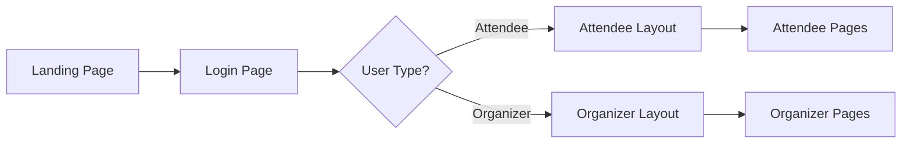

# Frontend Structure Documentation

## 📁 Production-Grade Folder Structure

The DrishtiX frontend has been restructured to follow industry best practices with clear separation of concerns, proper routing, and role-based organization.

## 🏗️ Architecture Overview

```
src/
├── pages/                    # Route-level components (page views)
│   ├── attendee/            # Attendee-specific pages
│   ├── organizer/           # Organizer-specific pages
│   └── common/              # Shared pages (landing, login, 404)
├── components/              # Reusable UI components
│   ├── attendee/           # Attendee-specific components
│   ├── organizer/          # Organizer-specific components
│   ├── shared/             # Shared components
│   └── ui/                 # Base UI components (buttons, cards, etc.)
├── layouts/                # Layout wrapper components
│   ├── RootLayout.tsx      # Global layout with providers
│   ├── AttendeeLayout.tsx  # Attendee dashboard layout
│   └── OrganizerLayout.tsx # Organizer dashboard layout
├── routes/                 # Routing configuration
│   └── index.tsx          # Main router setup
├── services/              # API services and business logic
├── hooks/                 # Custom React hooks
├── utils/                 # Utility functions
├── types/                 # TypeScript type definitions
├── styles/                # Global styles
└── App.tsx               # Root application component
```

## 🚀 Key Features

### 1. **React Router v7 Integration**
- Modern routing with lazy loading for better performance
- Nested routes for cleaner code organization
- Protected routes for authentication
- URL-based navigation state

### 2. **Role-Based Architecture**
- **Attendee Portal**: Event browsing, navigation, tickets, help
- **Organizer Portal**: Event management, analytics, operations, AI command

### 3. **Layout System**
- **RootLayout**: Global providers (IncidentProvider, Theme, Auth)
- **AttendeeLayout**: Sidebar navigation for attendee features
- **OrganizerLayout**: Context-aware navigation based on selected event

### 4. **Code Splitting & Performance**
- Lazy loading of page components
- Suspense boundaries with loading states
- Optimized bundle sizes

## 📍 Routing Structure

### Common Routes
```
/                          → Landing Page
/login                     → Login Page (role selection)
```

### Attendee Routes
```
/attendee/
  ├── dashboard           → Main dashboard
  ├── events              → Browse events
  ├── navigation          → Indoor navigation
  ├── tickets             → My tickets
  ├── help                → Help & support
  └── emergency           → Emergency services
```

### Organizer Routes
```
/organizer/
  ├── home                → Organizer home (event list)
  └── event/:eventId/
      ├── dashboard            → Event overview
      ├── command-center       → Central command
      ├── operations           → Team management
      ├── analytics            → Analytics & insights
      ├── ai-command           → AI automation
      ├── crowd-intelligence   → Crowd monitoring
      ├── dispatch             → Incident dispatch
      ├── gate-control         → Access control
      ├── automation           → Automation policies
      └── post-event           → Post-event analysis
```

## 🎨 Layout Components

### AttendeeLayout
- Collapsible sidebar navigation
- Role-specific menu items
- Persistent logout option
- Responsive design

### OrganizerLayout
- Dynamic navigation (changes based on event context)
- Event-specific routes appear when event is selected
- Grouped navigation sections
- Breadcrumb support

## 🔧 How to Add New Pages

### Adding an Attendee Page

1. **Create the page component**:
```tsx
// src/pages/attendee/NewFeaturePage.tsx
export default function NewFeaturePage() {
  return <div>New Feature</div>;
}
```

2. **Add route in routes/index.tsx**:
```tsx
{
  path: 'new-feature',
  element: <NewFeaturePage />,
}
```

3. **Add navigation item in AttendeeLayout.tsx**:
```tsx
{ name: 'New Feature', path: '/attendee/new-feature', icon: Star }
```

### Adding an Organizer Page

1. **Create the page component**:
```tsx
// src/pages/organizer/NewToolPage.tsx
import { useParams } from 'react-router-dom';

export default function NewToolPage() {
  const { eventId } = useParams();
  return <div>New Tool for Event: {eventId}</div>;
}
```

2. **Add route in routes/index.tsx**:
```tsx
{
  path: 'new-tool',
  element: <NewToolPage />,
}
```

3. **Add navigation item in OrganizerLayout.tsx**:
```tsx
{ name: 'New Tool', path: `/organizer/event/${eventId}/new-tool`, icon: Wrench }
```

## 🎯 Component Organization Guidelines

### Pages (`src/pages/`)
- **Purpose**: Route-level components that represent full page views
- **Responsibility**: 
  - Handle routing logic
  - Compose smaller components
  - Manage page-level state
  - Connect to services/APIs
- **Example**: `DashboardPage.tsx`, `EventHubPage.tsx`

### Components (`src/components/`)
- **Purpose**: Reusable UI components
- **Organization**:
  - `attendee/`: Attendee-specific features
  - `organizer/`: Organizer-specific features
  - `shared/`: Components used by both roles
  - `ui/`: Base UI components (buttons, cards, modals)

### Layouts (`src/layouts/`)
- **Purpose**: Wrapper components that provide structure
- **Features**:
  - Navigation
  - Headers/Footers
  - Context providers
  - Common UI elements

## 🔐 Authentication Flow



## 🛠️ Development Workflow

### Running the Application
```bash
cd drishti-frontend
pnpm install
pnpm dev
```

### Building for Production
```bash
pnpm build
```

### Type Checking
```bash
pnpm type-check
```

## 📦 Migration from Old Structure

### What Changed?
1. ❌ **Before**: All components in flat `components/` folder
2. ✅ **After**: Organized into `pages/`, `components/`, `layouts/`

3. ❌ **Before**: State-based navigation in `App.tsx`
4. ✅ **After**: URL-based routing with React Router

5. ❌ **Before**: No clear role separation
6. ✅ **After**: Dedicated attendee and organizer portals

### Backward Compatibility
- All existing components remain in `components/` folder
- Pages wrap existing components (no component rewrites needed)
- Gradual migration path available

## 🎨 Design Principles

### 1. **Separation of Concerns**
- Pages handle routing and orchestration
- Components handle UI and interactions
- Services handle data and business logic

### 2. **DRY (Don't Repeat Yourself)**
- Shared components in `components/shared/`
- Reusable layouts
- Common utilities

### 3. **Single Responsibility**
- Each component has one clear purpose
- Pages compose multiple components
- Layouts provide structure only

### 4. **Progressive Enhancement**
- Core features work without JS
- Enhanced with React
- Optimized with lazy loading

## 🚦 Navigation Examples

### Programmatic Navigation
```tsx
import { useNavigate } from 'react-router-dom';

function MyComponent() {
  const navigate = useNavigate();
  
  const goToEvents = () => {
    navigate('/attendee/events');
  };
  
  return <button onClick={goToEvents}>View Events</button>;
}
```

### Link-Based Navigation
```tsx
import { Link } from 'react-router-dom';

function MyComponent() {
  return <Link to="/organizer/home">Home</Link>;
}
```

### Getting Route Parameters
```tsx
import { useParams } from 'react-router-dom';

function EventPage() {
  const { eventId } = useParams();
  return <div>Event ID: {eventId}</div>;
}
```

## 🎯 Best Practices

### ✅ DO
- Keep pages thin (delegate to components)
- Use lazy loading for large pages
- Follow folder structure conventions
- Use TypeScript for type safety
- Document component props
- Write meaningful component names

### ❌ DON'T
- Put business logic in pages
- Create deeply nested folder structures
- Mix attendee and organizer components
- Duplicate components across folders
- Hardcode routes (use constants)

## 🔮 Future Enhancements

### Planned Improvements
1. **Authentication Guards**: Protected routes with role checks
2. **State Management**: Redux/Zustand for global state
3. **Error Boundaries**: Graceful error handling
4. **Testing**: Unit and integration tests
5. **Documentation**: Storybook for components
6. **Performance**: Further optimization with code splitting

### Migration Roadmap
- Phase 1: ✅ Structure and routing (DONE)
- Phase 2: Move components to proper folders
- Phase 3: Implement authentication
- Phase 4: Add state management
- Phase 5: Testing and documentation

## 📚 Resources

- [React Router Documentation](https://reactrouter.com/)
- [React Best Practices](https://react.dev/)
- [TypeScript Handbook](https://www.typescriptlang.org/docs/)
- [Vite Guide](https://vitejs.dev/)

## 🤝 Contributing

When adding new features:
1. Follow the folder structure
2. Create proper page components
3. Update routes configuration
4. Add navigation items
5. Document your changes
6. Update this README if needed

---

**Version**: 2.0.0  
**Last Updated**: January 2, 2026  
**Maintained by**: DrishtiX Development Team
